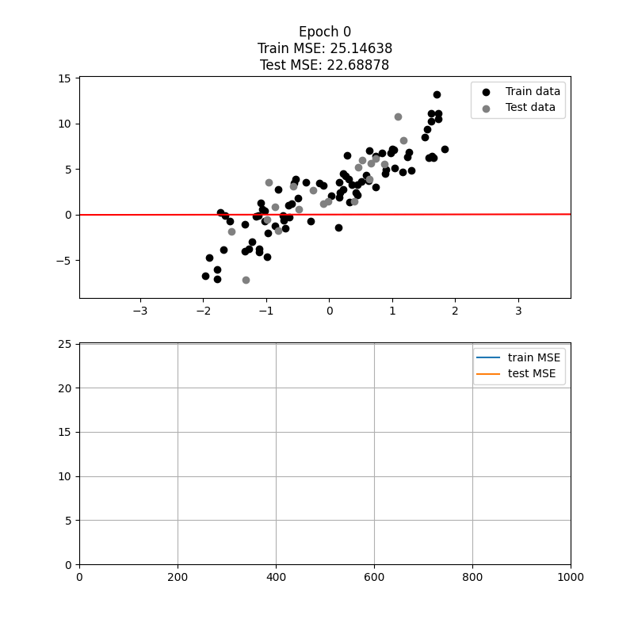
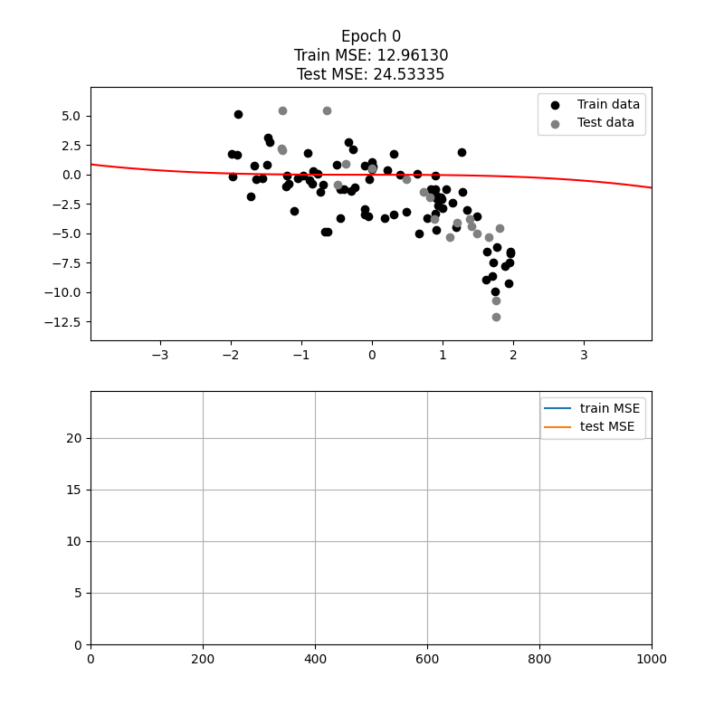
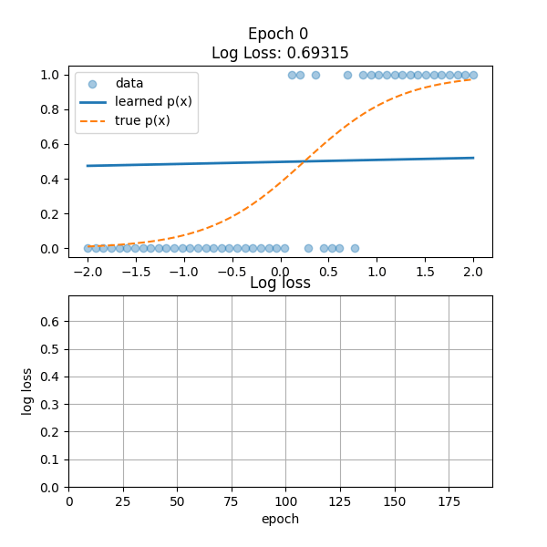
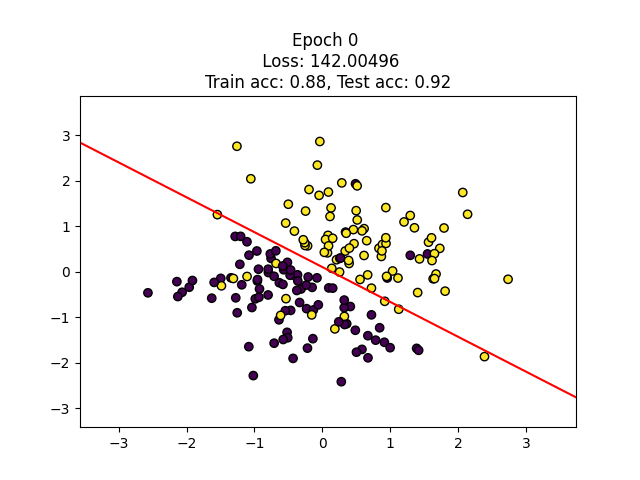
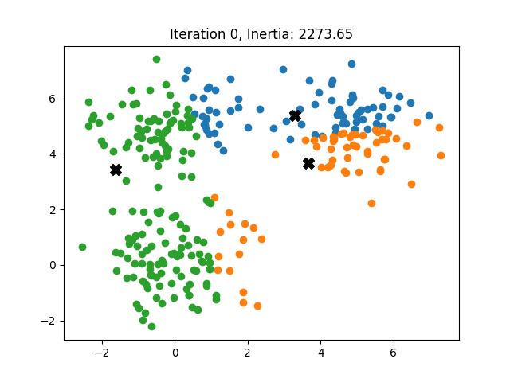

## Machine Learning from Scratch

A Python project implementing core machine learning algorithms from scratch, without relying on high-level libraries.
The goal is to understand mathematically how these algorithms work. 

## Implemented Algorithms
- [Linear Regression](src/linear_regression)
- [Polynomial Regression](tests/test_polynomial_regression.py)
- [Logistic Regression](src/logistic_regression)
- [K-Nearest Neighbors (KNN)](src/knn)
- [K-Means clustering](src/kmeans)
- [Support Vector Machine (SVM)](src/svm)

---

## Installation
```bash
git clone https://github.com/D1533/ml-from-scratch.git
cd ml-from-scratch
pip install -e .
```

---

## Examples

## Linear Regression

<p align="center">
  
</p>

## Polynomial Regression

<p align="center">
  
</p>

## Logistic Regression

<p align="center">
  
</p>

## SVM
<p align="center">
  
</p>

## K-Means
<p align="center">
  
</p>

---

## Mathematical Background

The following is a straighforward summary of the mathematical background of the algorithms.

### Linear Regression

Given a dataset $X \in \mathbb{R}^{m \times n}$ we want to learn a linear function that predicts $y \in \mathbb{R}$ from $x \in \mathbb{R}^n$, such that

$$
\hat{y} = w^T x + b,
$$

where $w \in \mathbb{R}^n, b \in \mathbb{R}$.

We define the Loss function as the MSE

$$
L(w, b) = \frac{1}{m}\Vert Xw + b\mathbb{1} - y \Vert^2.
$$

In order to minimize that function, we compute the  gradient of $L$

$$
\begin{aligned}
\nabla_w L &= \frac{2}{m}X^T(Xw + b\mathbb{1} - y), \\
\frac{\partial L}{\partial b} &= \frac{2}{m}\mathbb{1}^T(Xw + b\mathbb{1} - y),
\end{aligned}
$$

therefore 

$$
\begin{align*}
\nabla L &= \frac{2}{m}\left(X^T(Xw + b\mathbb{1} - y), \mathbb{1}^T(Xw + b\mathbb{1} - y)\right)^T.
\end{align*}
$$

Finally, the iterations for the gradient descent algorithm are defined as

$$
(w_{i+1}, b_{i+1})^T = (w_i, b_i)^T -\eta \nabla L(w_i, b_i).
$$

---

## Polynomial Regression

Polynomial regression extends linear regression by mapping the input $x \in \mathbb{R}^n$ into a higher-dimensional feature space.

We define a feature map $\phi : \mathbb{R}^n \to \mathbb{R}^N$, where $\phi(x)$ contains all monomials of degree $d$, that is, all 
$x_1^{a_1}x_2^{a_2}\cdots x_n^{a_n}$ where $a_1 + a_2 + \cdots + a_n \leq d$.

Then we apply linear regression in this transformed space:

$$
\hat{y} = w^T \phi(x) + b.
$$

Notice that the model is still linear in the parameters $w$, even though it is nonlinear in the original input $x$.

Therefore, polynomial regression can be solved using the same optimization framework as linear regression by replacing $X$ with the transformed $\Phi(X)$:

The loss function becomes

$$
L(w, b) = \frac{1}{m}\left\Vert \Phi(X)w + b\mathbb{1} - y \right\Vert^2,
$$

which is identical in form to linear regression.

Thus, polynomial regression is a special case of linear regression applied in a higher-dimensional feature space.


## Logistic Regression

Given a dataset $X \in \mathbb{R}^{m \times n}$, we want to learn a linear function that predicts a probability $y \in (0, 1)$ from $x \in \mathbb{R}^n$, such that

$$
\hat{y} = \sigma(w^T x + b),
$$

where $w \in \mathbb{R}^n$, $b \in \mathbb{R}$, and $\sigma$ is the sigmoid function defined as

$$
\sigma(z) = \frac{1}{1 + e^{-z}}.
$$

We define the loss function as the binary cross-entropy (log loss)

$$
L(w, b) = -\frac{1}{m} \sum_{i=1}^m \left[ y^{(i)} \log(\hat{y}^{(i)}) + (1 - y^{(i)}) \log(1 - \hat{y}^{(i)}) \right].
$$

Let

$$
z = Xw + b\mathbb{1}, \quad \hat{y} = \sigma(z).
$$

Then the gradient of the loss is given by

$$
\nabla_w L = \frac{1}{m} X^T (\hat{y} - y),
$$

$$
\frac{\partial L}{\partial b} = \frac{1}{m} \mathbb{1}^T (\hat{y} - y),
$$

therefore

$$
\nabla L = \frac{1}{m}\left(X^T (\sigma(Xw + b\mathbb{1}) - y), \mathbb{1}^T (\sigma(Xw + b\mathbb{1}) - y)\right)^T,
$$

where $\sigma(Xw + b\mathbb{1})$ is applied componentwise.


Finally, the gradient descent updates are

$$
(w_{i+1}, b_{i+1})^T = (w_i, b_i)^T - \eta \nabla L(w_i, b_i).
$$

---

## Support Vector Machine (SVM)

Given a dataset $X \in \mathbb{R}^{m \times n}$ with labels $y^{(i)} \in \lbrace -1, 1 \rbrace$ , we aim to learn a linear classifier of the form

$$
f(x) = w^T x + b,
$$

where $w \in \mathbb{R}^n$, $b \in \mathbb{R}$, and the predicted class is given by

$$
\hat{y} = \mathrm{sign}(w^T x + b).
$$

The SVM seeks a hyperplane that maximizes the margin while penalizing margin violations. This leads to the primal optimization problem

$$
\min_{w,b} \quad \frac{1}{2} \Vert w \Vert^2 + C \sum_{i=1}^m \max(0, 1 - y^{(i)}(w^T x^{(i)} + b)),
$$

where $C > 0$ is a regularization parameter. Therefore the loss function is

$$
L(w,b) = \frac{1}{2}\Vert w\Vert^2 + C\sum_{i=1}^m \max(0, 1 - y^{(i)}(w^T x^{(i)} + b)).
$$

Since the hinge loss is not differentiable, we use a subgradient. Defining the active set

$$
\mathcal{A} = \lbrace i : y^{(i)}(w^T x^{(i)} + b) < 1 \rbrace,
$$

a valid subgradient is

$$
\begin{aligned}
\partial_w L &= w - C \sum_{i \in \mathcal{A}} y^{(i)} x^{(i)}. \\
\partial_b L &= - C \sum_{i \in \mathcal{A}} y^{(i)}.
\end{aligned}
$$

therefore 

$$
\partial L = \left(w - C \sum_{i \in \mathcal{A}} y^{(i)} x^{(i)},  - C \sum_{i \in \mathcal{A}} y^{(i)}\\right)^T.
$$

Finally, the iterations for the gradient descent algorithm are

$$
(w_{i+1}, b_{i+1})^T = (w_i, b_i) - \eta\partial L(w_i, b_i)
$$

---

## K-Nearest Neighbors (KNN)

The k-Nearest Neighbors algorithm is a non-parametric method that does not involve training. 
Given a query point $x$, it finds the $k$ closest points in the training set according to a distance metric.

Let $d$ be a distance function, and let $\mathcal{N}_k(x)$ 
be the set of indices corresponding to the $k$ nearest neighbors of $x$.

For classification, the prediction is given by

$$
\hat{y} = \arg\max_{c \in \mathcal{C}} \left | \lbrace i \in \mathcal{N}_k(x) \ : \ y^{(i)} = c \rbrace \right |,
$$

where $\mathcal{C}$ is the set of all posible class labels.

For regression, the prediction is given by the average

$$
\hat{y} = \frac{1}{k} \sum_{i \in \mathcal{N}_k(x)} y^{(i)}.
$$

---

## K-Means

The k-means algorithm partitions the data into $k$ clusters by minimizing the within-cluster sum of squares.

Given a dataset $X \in \mathbb{R}^{m \times n}$, let $\mu_1, \dots, \mu_k \in \mathbb{R}^n$ be the cluster centroids, and let $c^{(i)} \in \lbrace 1, \dots, k \rbrace$ 
be the cluster assignment of $x^{(i)}$. The objective function is

$$
\min_{\mu_1,\dots,\mu_k} \sum_{i=1}^m \Vert x^{(i)} - \mu_{c^{(i)}} \Vert^2.
$$

The algorithm alternates between an assignment step and an update step of the centroids. That is, 

$$
\begin{aligned}
c^{(i)} &= \arg\min_{j \in \{1,\dots,k\}} \Vert x^{(i)} - \mu_j \Vert^2, \\
\mu_j &= \frac{1}{|\lbrace i \in \lbrace 1, \dots, m \rbrace \ : \ c^{(i)} = j \rbrace |} \sum_{i : c^{(i)} = j} x^{(i)},
\end{aligned}
$$


